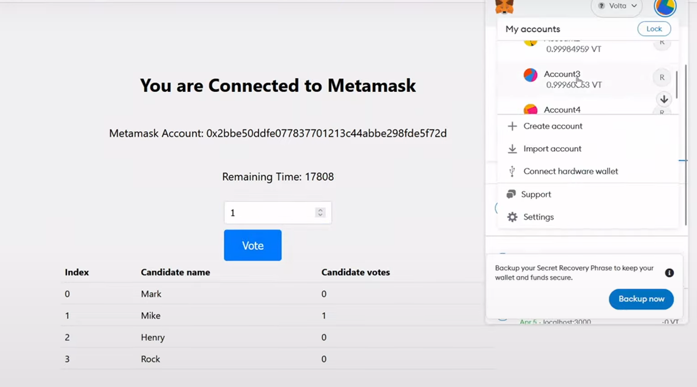

# 🗳️ Decentralized Voting Application

  

## 🚀 Tech Stack  
- **Frontend**: React, Web3.js, Ethers.js  
- **Backend**: Solidity, Hardhat  
- **Blockchain**: Ethereum (Goerli Testnet)  
- **Authentication**: MetaMask  

## 📌 Features  
- Cast votes on the Ethereum blockchain  
- View candidates and vote counts in real-time  
- Smart contracts deployed using Hardhat  

## 🔧 Setup  

### 1️⃣ Clone the Repository  
```bash
git clone https://github.com/your-repo.git
cd your-repo
